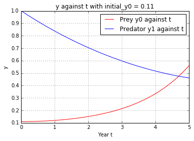

UECM3033 Assignment #3 Report
========================================================

- Prepared by: Phoong Jin Zhi
- Tutorial Group: T2

--------------------------------------------------------

## Task 1 --  Gauss-Legendre formula

The reports, codes and supporting documents are to be uploaded to Github at: 

[https://github.com/Jinzhi94/UECM3033_assign3](https://github.com/Jinzhi94/UECM3033_assign3)

Explain how you implement your `task1.py` here.

To perform the Gauss-Legendre integration, we first need to make sure the interval is between -1 and 1
so before we get into the formula, I used Lagrange polynomial to tranfrom the interval which is given by
y = a*((x-1)/(-1-1)) + b*((x+1)/(1+1)) and the jacobian for this transformation is (b-a)/2. 
After that, I used leggauss from the module numpy.polynomial.legendre to obtain the weights and nodes
(stored them into x and w respectively) in the Gauss-Legendre quadrature. After transformed the nodes x into
a new variable, namely y, finally I took the dot product of f(y) and w and also the jacobian (b-a)/2 to obtain
the answer.

Explain how you get the weights and nodes used in the Gauss-Legendre quadrature.

Just as mentioned above, I used leggauss from the module numpy.polynomial.legendre to obtain the weights and nodes
which then stored into the variable x and w.

---------------------------------------------------------

## Task 2 -- Predator-prey model

Explain how you implement your `task2.py` here, especially how to use `odeint`.

First i defined a function ode_system to store the ODE system which has 4 parameters, y = [y0,y1], t = np.linspace(0, 5, 101),
a and b. After that, I stored the given value into a, b and y. Notice that, i set the t be np.linspace(0, 5, 101) which
is 100 uniform partition  from t = 0 to 5. When everything is ready, I used the odeint from the module scipy.integrate
to help us to solve this nonlinear ODE system.

Put your graphs here and explain.

This is the graph of y0 and y1 against t, where the initial condition is y0 = 0.1, y1 = 1.0

This is the graph of y1 against y0, where the initial condition is y0 = 0.1, y1 = 1.0 

This is the graph of y0 and y1 against t, where the initial condition is y0 = 0.11, y1 = 1.0

This is the graph of y1 against y0, where the initial condition is y0 = 0.11, y1 = 1.0 

Is the system of ODE sensitive to initial condition? Explain.

As you can see difference between the graph for both case are not significant, this implies that the
system of ODE is not sensitive to initial condition.

-----------------------------------

last modified: change your date here
